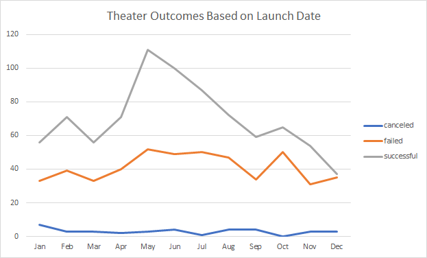
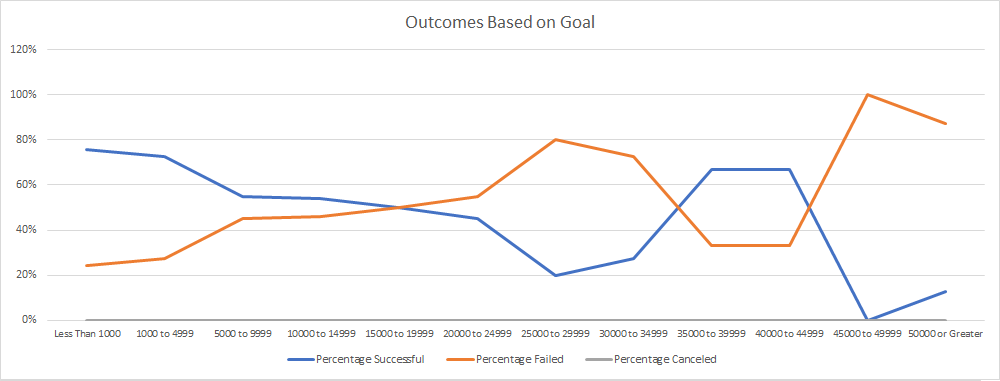

# Analysis of Kickstarter Outcomes for Theater Plays 
## Project Overview
Our client, Louis, is funding a theater play using Kickstarter with a goal of raising $10,000.  She’s asked us to utilize a large dataset from Kickstarter to evaluate success rates for campaign funding based on their goal.  The scope of this project is to analyze outcomes based on launch date and based on funding goal using the theater in the category subset.  In addition to analysis of the request, we will discuss challenges that we encountered, limitations of the dataset, and future analysis we would recommend.  
## Analysis and Challenges
In this section, we will analyze the charts and graphs that we created based on campaign outcomes and funding goals.  
### Analysis Outcomes Based on Launch Date
To determine if there are periods during the year that are more successful to launch a Kickstarter theater campaign, we decided to chart and graph campaign outcomes based on the month they were launched.   The following steps were taken to generate the pivot chart and line graph in Excel:
1.	Within the Kickstarter worksheet, the numerical date of launch was converted to a readable date format using the Epoch formula. The formula can be seen in column S2 of the “Kickstarter” worksheet in the spreadsheet found here (.
2.	Within the same worksheet, a second column was added to hold the Year of the campaign using the YEAR() function.  
3.	In a new worksheet “Theater Outcomes by Launch Date”, a pivot chart showing a count of outcomes by Month using Year and Category filters was generated.
4.	A filter value for the “theater” category was applied to the chart.
5.	The chart columns were sorted in descending order so “successful” outcomes were listed first.
6.	The following line chart was created showing total outcomes by month.

For this step, I was challenged to understand why my line graph showed a percentage totaling more than 100% and looked different than the illustration.  I filtered the data in the spreadsheet to spot check my results and the results were correct, so I stepped through the exercise again.  I found that I had chosen a “Stacked Line” chart which was incorrect. 
### Analysis of Outcomes Based on Goals
In our second analysis, we group the subcategory of “Plays” into funding goal buckets and evaluate what percentage of them were successfully funded.  Our totals include successful, failed and canceled campaigns that were in the Category of “Theater” and the subcategory of “Play”.  
1.	We use a COUNTIFS statement to count the outcomes of campaigns in the ranges we determined. COUNTIFS formulas can be viewed in Worksheet “Outcomes Based on Goals” B2:D13 in the spreadsheet in this repository.  I utilized a cell with the Outcome value for my formulas (Hidden in row 15 to) so that the formulas could be copied across the 3 columns.   
2.	The percentage of each outcome was calculated by using the SUM function and dividing each outcome count by this sum and the data type set to a percentage.
3.	The percentages were charted using a line chart which can be viewed below.

For this exercise, my chart did not look like the one illustrated in the instructions.  I had a similar pattern but it was not the same.  I also added a sum total to spot check my counts against manual rowcounts I did in the kickstarters tab but they were correct.  I went back through the challenge and wrote a checklist for myself of each requirement. I found that I had applied a “Theater” category filter instead of the “Plays” subcategory.  This fixed my problem. 

# Results
## Conclusions
In the chart “Theater Outcomes by Launch Date” above, you can see May, June and July were the most successful months for a launch with May having the highest number of successes.  There are also a larger percentage of successes vs failed/canceled in May and June than any other month which bolsters the recommendation for launching this time of year.  A launch late in the year would not be recommended with success rates dropping off with the least successful month being December.  
The chart above titled “Outcomes Based on Goals” shows that “Theater Play” campaigns are most successfully funded when they are less than $15,000.  Those that are $5,000 or less have a greater than 70% success rate.  Louis’ goal for $10,000 is within the range where successes are more likely. 
## Dataset Limitations
The data in the worksheet “Outcomes Based on Goals” found <here> shows we have a larger amount of data on campaigns $15,000 or less compared to larger goal amounts.  For Louis’ needs, this analysis was useful.  If we were evaluating goals of greater than $15,000, our dataset has a limited number of records.
Another limitation of the dataset is that we do not know if they funding amount met the needs of the project.  If additional funds were needed, we don’t know if follow-on campaigns were successful for that project.  
We also feel that knowing the specific donation amounts per donation for each campaign would be beneficial to identifying Louis’ marketing targets.  We can only obtain the “Average Donation” with the data we have.
## Additional Data Analysis Suggestions
Additional analyses we could perform include
1.	Further Filtering the campaign launch dates by geography.  Are the higher percentage success rates due to the time of the year or the season the country is in?  Analyze US, North America and North America, Europe for example.
2.	Charting out the average success rates based on duration.
3.	Further filtering the launch data and goal data to the only the most recent years to determine if Kickstarter funding patterns have changed as they have become more mainstream.

